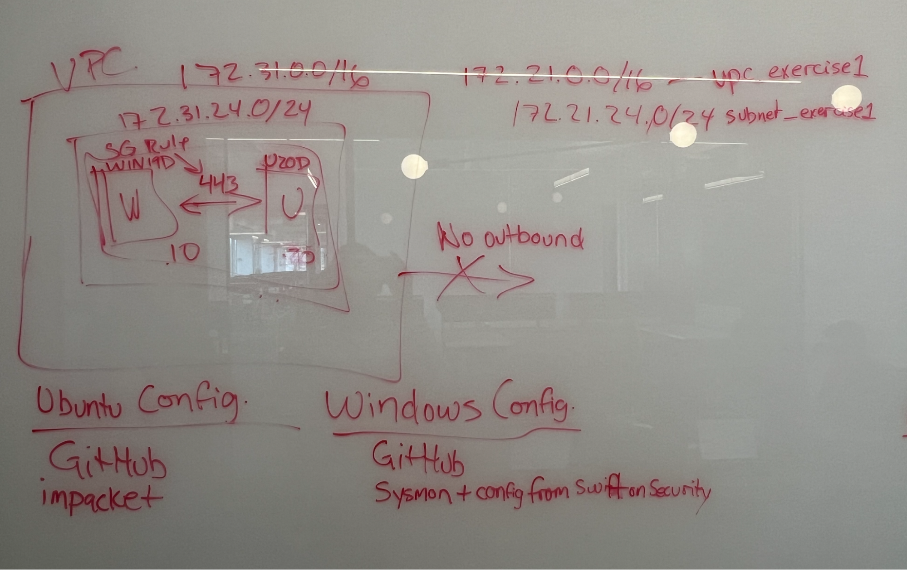
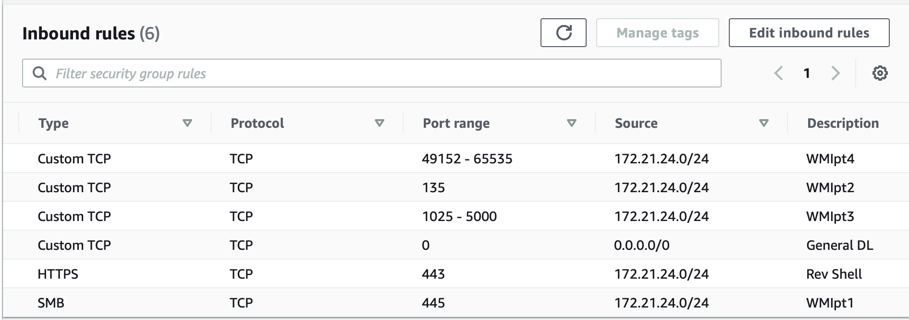
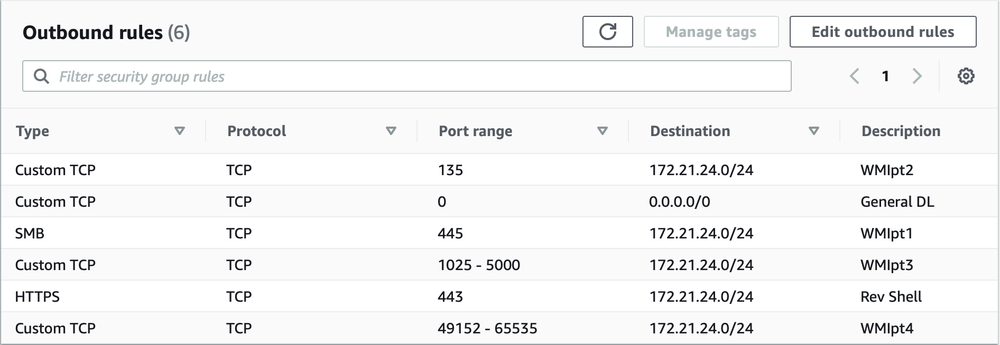
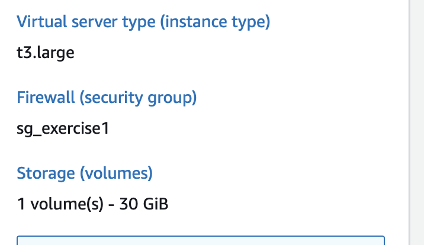

# Green Team Notes

## Requirements

Range Requirements:
- Defender is not turned off
- TCP shell existing on the Windows endpoint

Blue Team Requirements: 
- Sysmon installed and Config applied (https://github.com/SwiftOnSecurity/sysmon-config) 

Red Team Requirements:
- impacket (https://github.com/fortra/impacket) 
443 open (for shell)

## General Notes

Created separate Ip’s subnets for the four boxes
(172.21.0.0/16, 172.21.24.0/24 ) (172.31.0.0/16, 172.31.24.0/24)

## Security Group Rules

Name: Sg_exercise1

1.egress / ingress tcp 443 only to subnet , tcp 135 , 445  (reverse shell goshell.exe)
2. Ingress from everywhere
3. egress / ingress ports 135, 445, 1025-5000, 49152-65535 only to subnet.

- Created internet gateway, attached to created vpc, attached that to the route table. 
- Next went into the guac instance created in Jay’s case it was the Pluralsight custom u18 ami. 

## Additional References

https://guacamole.apache.org/doc/gug/configuring-guacamole.html
